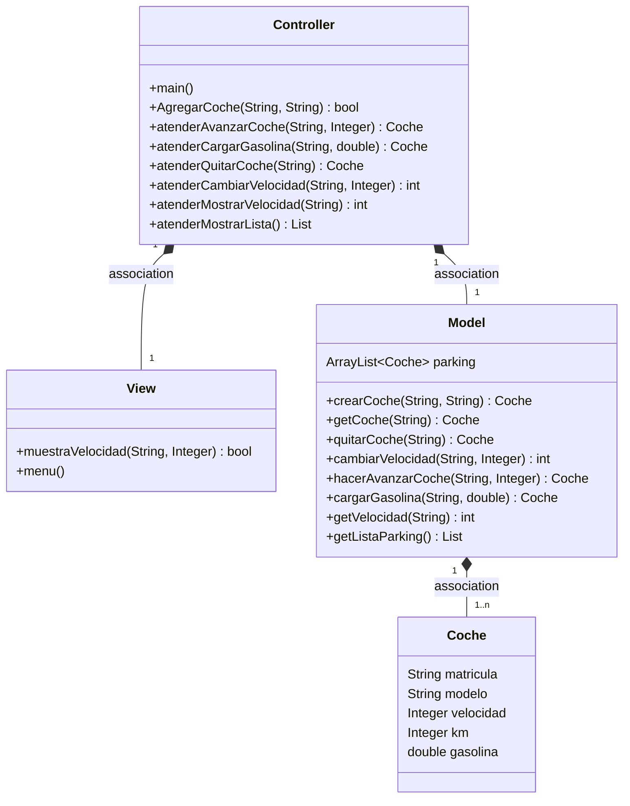
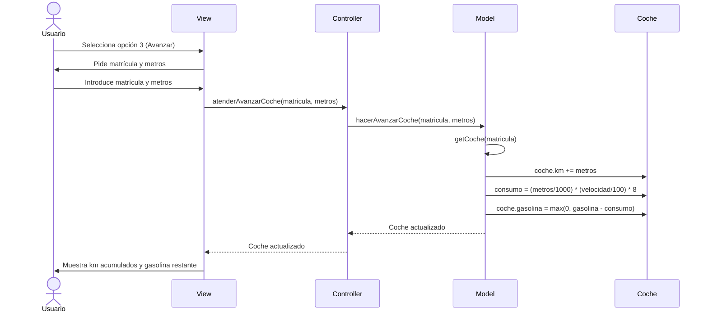
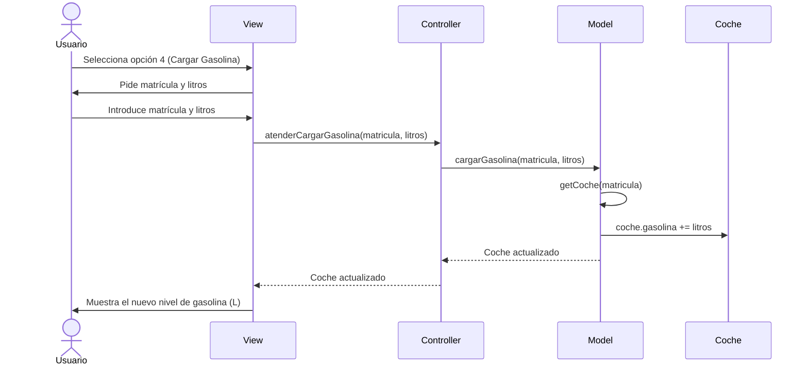

# Arquitectura MVC

Aplicación en Java para gestionar un parking de coches usando el patrón **MVC (Modelo-Vista-Controlador)**.

---

## Diagrama de clases



---

## Diagramas de secuencia

### Avanzar Coche



### Cargar Gasolina



---

## Opciones del menú

| Opción | Acción |
|--------|--------|
| 1 | Agregar Coche |
| 2 | Quitar Coche |
| 3 | **Avanzar Coche (metros)** — suma km y gasta gasolina |
| 4 | **Cargar Gasolina (litros)** — rellena el depósito |
| 5 | Cambiar Velocidad |
| 6 | Mostrar Velocidad |
| 7 | Coches en el parking |
| 8 | Salir |

## Fórmula de consumo

```
consumo (L) = (metros / 1000.0) * (velocidad / 100.0) * 8.0
```

Cuanto más rápido va el coche, más gasta.

## Cómo compilar y ejecutar

```bash
cd src
javac *.java
java Controller
```

## Javadoc

```bash
javadoc -d docs -author -version src/*.java
```

## Autor

Felipe · v2.0
